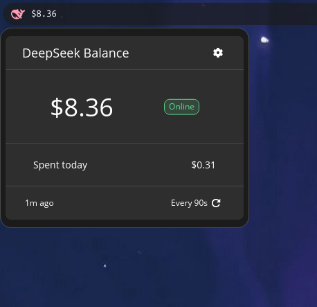

# DeepSeek Balance

A small [COSMIC](https://github.com/pop-os/cosmic-epoch) panel applet that shows your
[DeepSeek](https://platform.deepseek.com/) API account balance, right in the panel.



## Features

- Balance shown directly in the panel (with currency symbol)
- Popup with a full breakdown: total / topped-up / granted balance
- Auto-refreshes on a configurable interval (minimum 30s)
- Manual refresh button
- Follows system color scheme
- API key and refresh interval configurable from the applet itself
- Falls back to `DEEPSEEK_API_KEY` environment variable

## Installing

### One-liner

Requires [Rust](https://rustup.rs) and [`just`](https://github.com/casey/just):

```sh
curl -sSL https://raw.githubusercontent.com/SerhioGonsales/deepseek-balance-applet/main/install.sh | bash
```

This clones the repo, builds a release binary, and installs to `~/.local`.

### From source

```sh
git clone https://github.com/SerhioGonsales/deepseek-balance-applet.git
cd deepseek-balance-applet

just install-user   # installs to ~/.local, no root needed
# or
sudo just install   # system-wide to /usr
```

After installation, open **Settings → Desktop → Panel → Applets** and
add **DeepSeek Balance**.

### Uninstalling

```sh
just uninstall-user   # if you used install-user
sudo just uninstall   # if you used system-wide install
```

## Setting up your API key

Click the applet in the panel, then the gear icon in the popup. Enter your
DeepSeek API key and preferred refresh interval, then **Save**.

Alternatively, set the `DEEPSEEK_API_KEY` environment variable before launching
the session.

> **Note:** the key is stored in plain text in
> `~/.config/cosmic/com.github.serhio.DeepSeekBalance/v1/api_key`
> (COSMIC's standard config — not an encrypted store).

## License

[MPL-2.0](LICENSE)

> DeepSeek whale icon by [Icons8](https://icons8.com)
